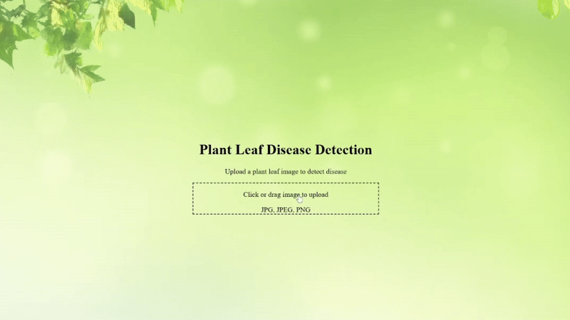

🌿 Plant Leaf Disease Detection System
## 🎥 Demo

Plant Leaf Disease Detection is an intelligent image-based disease identification platform designed to help farmers, gardeners, and agricultural researchers quickly identify plant leaf diseases and take preventive action.

This project is built using React + Tailwind CSS (Frontend) and Django REST Framework + Machine Learning (Backend), providing real-time disease prediction from uploaded leaf images along with confidence scores and a clean, user-friendly dashboard.

🌟 ✨ Key Features
✅ 1. Image-Based Leaf Disease Detection

Upload plant leaf images (JPG, JPEG, PNG)

Real-time disease prediction using ML model

Automatic image preprocessing before inference

Supports multiple plant disease classes

✅ 2. Machine Learning–Powered Prediction Engine

Classical Machine Learning–based image classification

Feature extraction using image processing techniques

Trained on PlantVillage dataset

Returns:

Predicted disease name

Confidence score

Example:

Disease: Tomato – Early Blight
Confidence: 0.84

✅ 3. Clean & User-Friendly Dashboard

Minimal, green-themed UI

Drag-and-drop image upload

Controlled image preview (no layout break)

Clean disease name formatting

Real-time result display

✅ 4. Disease Information & Prevention Guidance

Displays symptoms and prevention tips for detected diseases

Helps users understand:

Causes of disease

Preventive agricultural practices

Improves usability beyond just prediction

✅ 5. Full-Stack ML Integration

Frontend → Backend → ML Model → Frontend flow

REST API–based communication

Scalable architecture for future extensions

🏗️ Tech Stack
🎨 Frontend

React.js (Vite)

Tailwind CSS

JavaScript (ES6+)

🧠 Backend

Django

Django REST Framework

SQLite3 (development)

Python

🤖 Machine Learning

Scikit-learn

OpenCV

NumPy

Classical ML algorithms (no deep learning)

⚙️ Other Tools

Postman (API testing)

Git & GitHub

NPM

Python Virtual Environment

📂 Project Structure
leaf-disease-detector/
│
├── frontend/              # React + Vite frontend
│
├── backend/               # Django REST API
│
├── ml/                    # ML notebooks, dataset & model
│
└── README.md

📥 How to Clone & Run the Project
🖥️ 1. Clone the Repository
git clone https://github.com/Pushpa2-ai/leaf-disease-detector.git
cd leaf-disease-detector

🛠️ Backend Setup
cd backend
python -m venv venv
venv\Scripts\activate   # Windows
pip install -r requirements.txt
python manage.py migrate
python manage.py runserver

Backend will run on:
👉 http://127.0.0.1:8000

🎨 Frontend Setup
cd frontend
npm install
npm run dev

Frontend will run on:
👉 http://localhost:5173

🧠 ML Logic Inside Plant Leaf Disease Detection
Feature	ML / Logic Used
Image preprocessing	OpenCV (resize, normalization)
Feature extraction	Texture, color, shape features
Classification	Classical ML (Scikit-learn)
Confidence scoring	Probability-based output
Prediction pipeline	REST API integration
🚀 Future Enhancements

🌱 Support for more plant species & diseases

🧠 Deep Learning model integration (CNN)

📱 Mobile-responsive UI improvements

☁️ Cloud deployment (AWS / Render)

📊 Admin analytics dashboard

📸 Camera-based live detection

📄 License

MIT License — Free to use and improve.

🤝 Contributing

Feel free to fork this repository, submit pull requests, or open issues for improvements.

🙌 Author

Pushpa Kumari

👩‍💻 B.Tech (CSE-AIDS) | Full-Stack Developer
🔥 Passionate about building intelligent systems with clean UI and scalable backend architectures.
